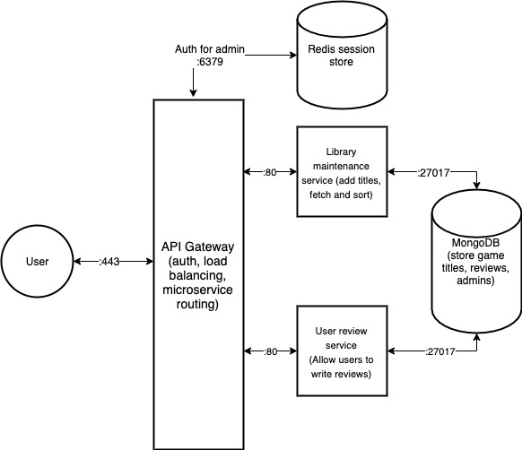

# GameReviews

## Problem 
When looking for video games to play, one usually has to know what they are looking for, or browse on game store pages such as the Steam store. After knowing what kind of game they are looking for, one may go to a review site to get a sense of how well the game has been received by others. However, there is no real site or app for browsing games and checking out reviews simply with no other noise. Review sites like IGN simply have review articles for new games and no clear way to navigate between genres or consoles. 

In short, the problem we are aiming to solve is the lack of a simple, focused platform for game reviews that gamers on any console can visit for browsing games and providing reviews. 

## Solution
As gamers ourselves, we would love to be able to have and use a service that allows us to browse games across any console when we want to simply do some game “window-shopping” or check how well a game that we are particularly interested in is doing. A simple interface that just shows games, with their reviews and some info about their reviews would be all we need. We would also love to provide and contribute to these reviews. 

## Architecture

## User Stories
Priority | User | Description | Implementation
--- | --- | --- | ---
P0 | User | I want to find games that are available on each of the consoles I own. | After a **HTTP GET** request by the client, the games service will display available games. These will be retrieved by console by default.
P1 | User | I want to quickly filter games that are under a certain approval rating. | Create an affordance for **GET** requests that contain a query string parameter for the approval threshold, and display the response.
P2 | User | I want to upload my own review to contribute to overall rating of a game | Send an **HTTP POST** request that contains data about who the reviewer is and the contents of the review.

